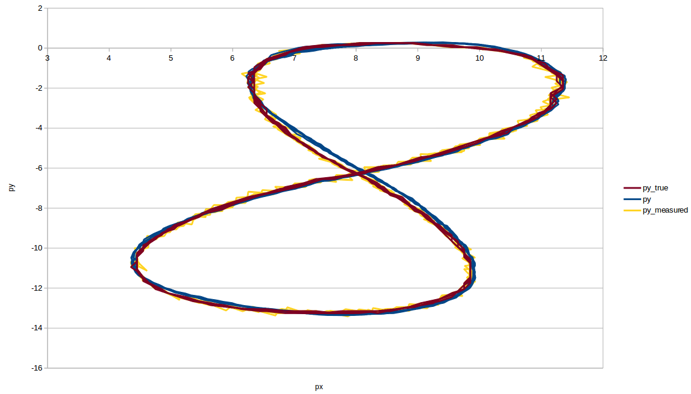
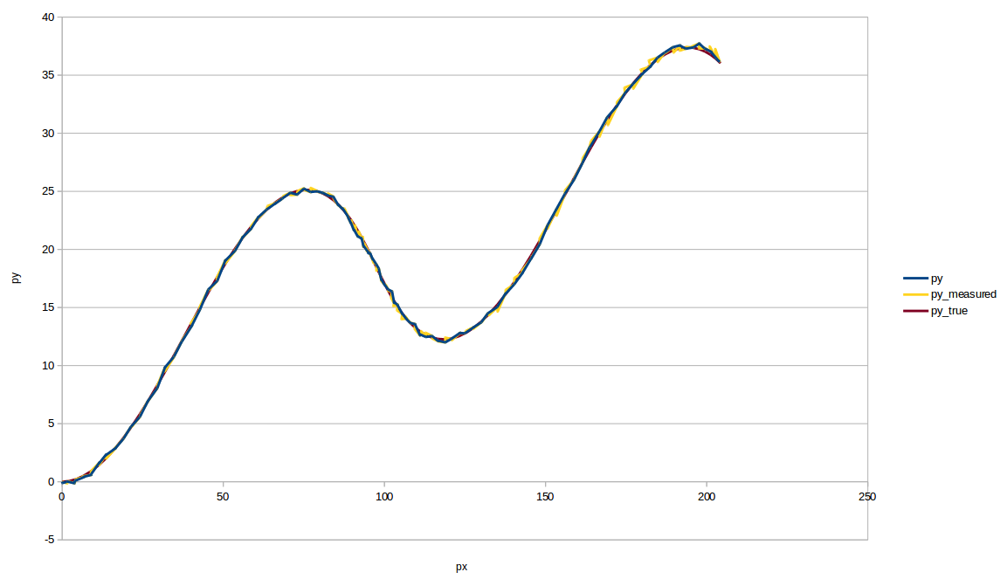

# Unscented Kalman Filter Project
The project goal was to create an unscented Kalman filter in C++ using sensor fusion from two sources ( RADAR and LIDAR ) to predict the position and velocity of the object tracked.

---

## Dependencies

* cmake >= v3.5
* make >= v4.1
* gcc/g++ >= v5.4

## Basic Build Instructions

1. Clone this repo.
2. Make a build directory: `mkdir build && cd build`
3. Compile: `cmake .. && make`
4. Run it: `./UnscentedKF path/to/input.txt path/to/output.txt`. You can find
   some sample inputs in 'data/'.
    - eg. `./UnscentedKF ../data/sample-laser-radar-measurement-data-1.txt output.txt`

## Results on samples provided

#### Sample 1:
* accuracy - RMSE:
0.0754797
0.0840537
0.582799
0.578968

* Graph that shows the ground truth, the measurement and prediction
 

#### Sample 2:
* Accuracy - RMSE:
0.189849
0.18758
0.28123
0.438625

* Graph that shows the ground truth, the measurement and prediction
 
